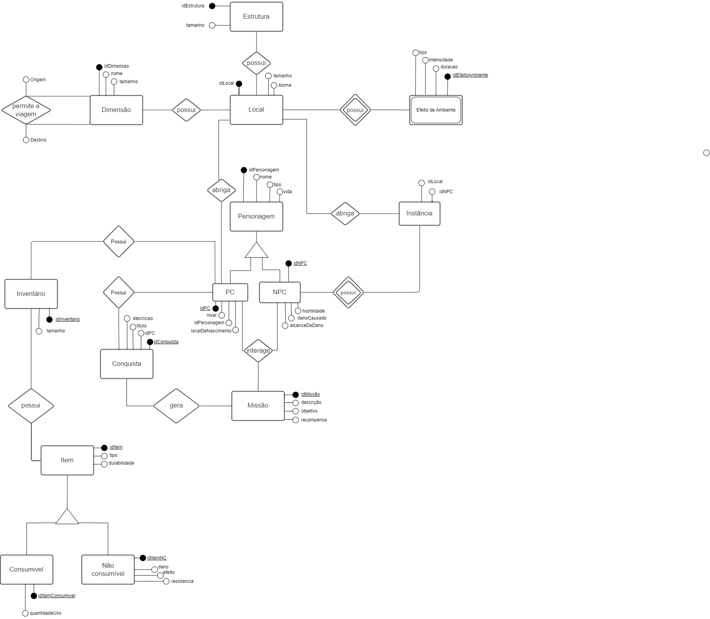

# Modelo Entidade Relacionamento (MER)

O MER é um modelo conceitual de alto nível de abstração que representa as entidades com os seus atributos, além dos seus respectivos relacionamentos.

## 1. Entidades
São os objetos ou conceitos do mundo real presentes no sistema e representados no diagrama.

- **Dimensão**
- **Local**
- **Estrutura**
- **Efeito de Ambiente**
- **Personagem**
    - **PC**
    - **NPC**
- **Instância**
- **Conquista**
- **Inventário**
- **Item**
    - **Consumível**
    - **Não consumível**

## 2. Atributos
São as características ou propriedades que descrevem as entidades.

- **Dimensão**: <u>idDimensao</u>, nome, tamanho;
- **Local**: <u>idLocal</u>, idDimensao, tamanho, bioma;
- **Estrutura**: <u>idEstrutura</u>, idLocal, tamanho;
- **Efeito de Ambiente**: <u>idEfeitoAmbiente</u>, idLocal, duracao, intensidade, tipo;
- **Personagem**: <u>idPersonagem</u>, nome, tipo, vida;
    - **PC**: <u>idPC</u>, idPersonagem, nivel, localDeNascimento;
    - **NPC**: <u>idNPC</u>, idPersonagem, hostilidade, danoCausado;
- **Instância**: idLocal, idNPC;
- **Conquista**: <u>idConquista</u>, idPC, descricao;
- **Inventário**: <u>idInventario</u>, idPC, tamanho;
- **Item**: <u>idItem</u>, idInventario, tipo, durabilidade;
    - **Consumível**: <u>idItemConsumivel</u>, idItem, quantidadeUso;
    - **Não consumível**: <u>idItemNC</u>, idItem, resistencia, dano, efeito;

## 3. Relacionamentos
Representam as associações entre entidades, descrevendo como elas estão conectadas e interagem entre si.

- Dimensão __permite a viagem__ entre Dimensão

-  Local __possui__ Dimensão 

- Estrutura __possui__ Local
    
- Local __possui__ Efeito de Ambiente

- Local __abriga__ Instância

- Personagem __possui exclusivamente__ tipos PC e NPC

- Instância __possui__ NPC

- Local __abriga__ PC

- PC __possui__ Conquista e __possui__ Inventário

- Inventário __possui__ Item

- Item __possui exclusivamente__ tipos Consumível e Não consumível

# Diagrama Entidade Relacionamento (DER)
O Diagrama Entidade Relacionamento (DER) é a representação gráfica usada pelo Modelo Entidade Relacionamento para representar seus elementos, descrevendo a estrutura do banco de dados usando entidades, atributos e relacionamentos.

 

    
Figura 1: DER Minecraft

    
    
Fonte: Autores

## Histórico de Versões

| Versão |  Data | Descrição | Autor |
| :----: | :---: | --------- | ----- |
| 1.0    | 24/09/2023 | Criação do DER | [Maria Alice](https://github.com/Maliz30)   [Mateus](https://github.com/MateusPy)   [Nicolas](https://github.com/NickGehjk)   [Victor Hugo](https://github.com/)  |
| 1.1 | 25/09/2023 | Criação do ReadMe | [Maria Alice](https://github.com/Maliz30)   [Mateus](https://github.com/MateusPy)|