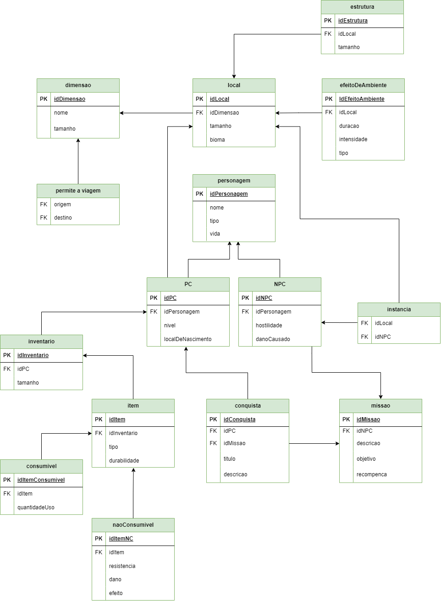

# Modelo Relacional (MREL)
O Modelo Relacional (MRel) é um modelo lógico que descreve o banco de dados, ou seja, representa como as tabelas serão construídas. Ele possui um nível de abstração menor que o Modelo Entidade Relacionamento (MER), se aproximando mais do nível exigido pelo Sistema de Banco de Dados (SGBD).

 

    
Figura 1: MREL Minecraft

    
    
Fonte: Autores

